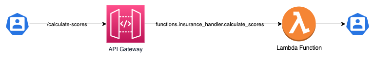

# Insurance Score Calculation
## Summary
This is a Score Calculation Engine designed to accept a user input and calculate Insurance Risks based on the defined business rules.

I chose to develop this engine using Python 3.9 and the Flask framework for the ease of development and local testing, but this architecture could be used in a real-life production environment using Cloud Services like AWS (explained on the `Architecture` Section in the end of this file) or GCP.
## Project Structure
|Directory|Meaning|
|-|-|
|/|Main directory containing the project itself.|
|/functions|This directory holds the functions available to run the engine.|
|/lib/models|This directory holds the classes to support the app's functionalities.|
|/config|This directory contains configurations to support the defined Business Rules.|
|/tests|This directory has all the tests logics.|
|/tests/mocks|This directory holds mock files, the base data to run the tests.|
|/tests/utils|This directory holds testing utils, such as pytest fixtures.|
## Local setup
### Getting started
```shell
cd ~

# Cloning the repository
git clone git@github.com:2904nando/score-calculation.git
# or git clone https://github.com/2904nando/score-calculation.git

cd score-calculation
```
### Creating and Activating Virtual Environment
```shell
python -m venv score-calculation-venv
source score-calculation-venv/bin/activate
```
### Installing dependencies
This app uses Pipenv and a Pipfile to hold its dependencies.
```shell
pipenv install
```
### Running Tests
I used pytest as the Testing Framework for this project. You can run all the tests in the `/tests` directory with the following command:
```shell
pytest tests
```
### Running the App
```shell
python3 app.py
```
## Usage considerations
When the app executes, it spawns a localhost flask server on port 5000. The main function `calculate-scores` can be called through the `/calculate-scores` route.
### Request Fields Validations
|Field|Required|Type|Possible Values|
|-|-|-|-|
|age|**Yes**|Integer|Equal or greater than 0.|
|dependents|**Yes**|Integer|Equal or greater than 0.|
|income|**Yes**|Integer|Equal or greater than 0.|
|marital_status|**Yes**|String|"single" or "married".|
|risk_questions|**Yes**|Array|3 Boolean values (0 or 1).|
|house|No|Object|Object with a single `ownership_status` attribute, which can be "owned" or "mortgaged".|
|vehicle|No|Object|Object with a single `year` attribute containing a positive Integer corresponding the year the vehicle was manufactured.|

*Note: Any field not following the validation rules listed above will throw an `Invalid Input!` Exception with Status Code `500`.*
### Testing the App
Tests can be done using Postman or any other Http Client.
You must send a POST request to `http://localhost:5000/calculate-scores`, providing a JSON body containing the necessary fields listed above.
You can also run the following CURL command:
```SHELL
curl -XPOST -H "Content-type: application/json" -d '{
  "age": 35,
  "dependents": 2,
  "house": {"ownership_status": "owned"},
  "income": 0,
  "marital_status": "married",
  "risk_questions": [0, 1, 0],
  "vehicle": {"year": 2018}
}' 'http://localhost:5000/calculate-scores'
```
## Technical decisions
### Tests
I decided to use pytest as my prefered testing framework for its simplicity and ease of use.
I also created a base for a testing mechanism based on dynamic fixtures. The fixture created (`mock_loader`) can load JSON files from various `/mocks` directories and can be used for getting inputs and expected outputs as an example.

The test methods using this fixture can have dynamic parameters sent in order to search the correct paths and get the files which will be used as input for the function, as well as the expected outputs for asserting.
### Configurations
In the `/config` directory, you can find a file with a Dictionary containing score-calculating methods and their impact on Insurance scores.
I chose to create this logic in order to accomodate and facilitate maintenance in the future, as business requirements for the Score Calculations might change.

In the event of a change in Business Rules:
|Action|Modification|
|-|-|
|Existing Business Rule - Change in Score Impact + Ineligibility|Only modifying the configurations on `/config` to accommodate the changes.|
|New Business Rule|Creating new node on `/config` + Implementing calculated *property* **with the same name as the created node** on `/lib/models/user_input.py`.|
### Architecture
For simplicity sake for this example exercise, as explained in the summary, I chose to develop the webserver using Flask.
For a production environment, I would recommend using a Cloud Service, such as AWS and deploy the necessary Resources using the Serverless Framework, following IaC practices.

Here is an overview of what this Architecture should look like:



And this architecture could be deployed using the Serverless Framework following the basic boilerplate describe in the following file:

[Suggested Serverless](improvements/suggested_serverless.yml)
